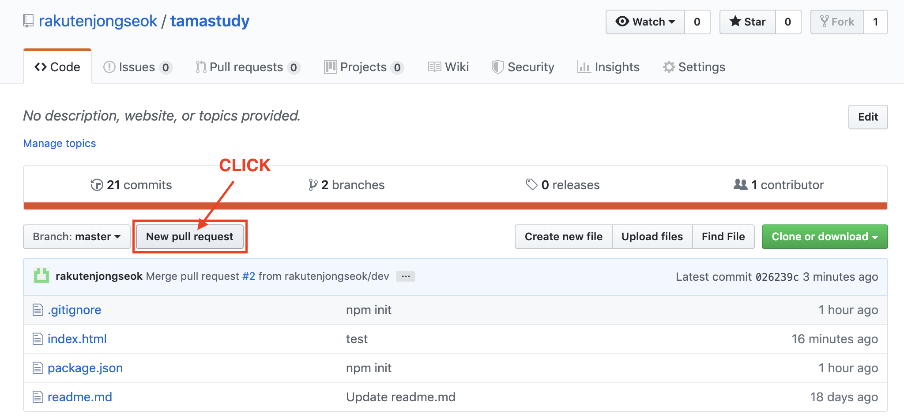
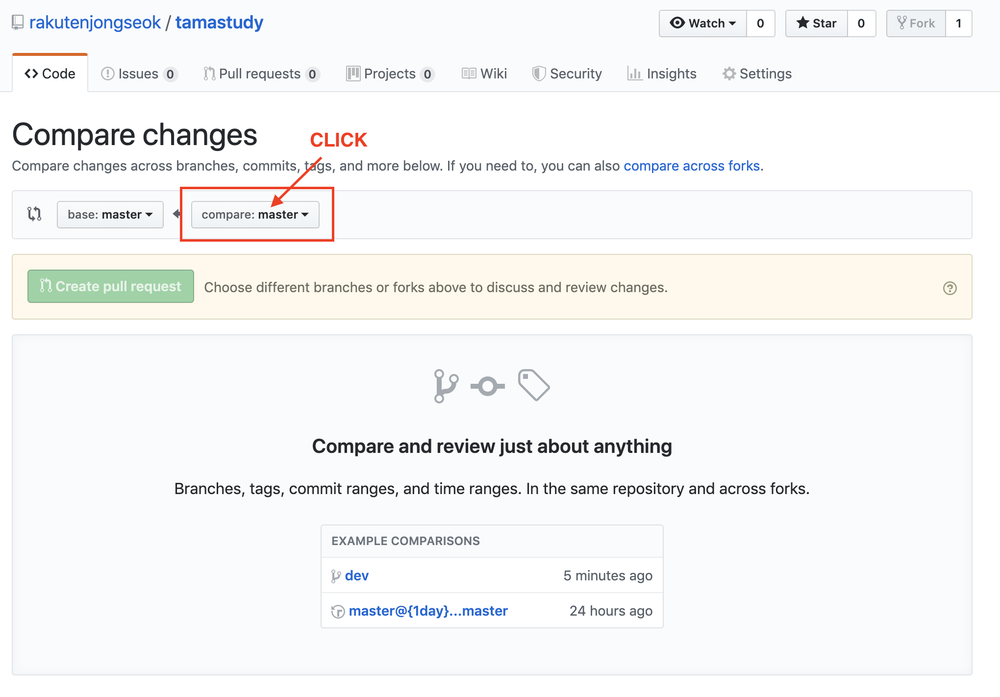
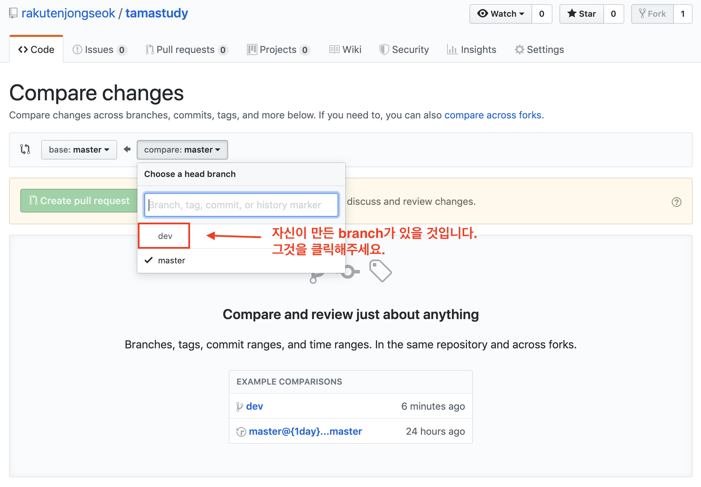
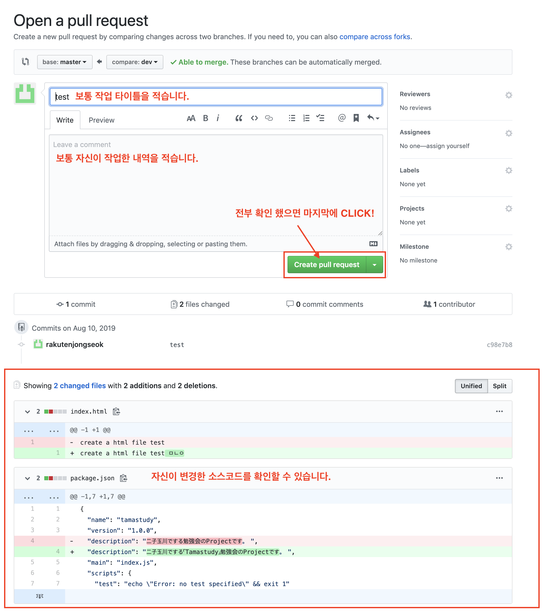
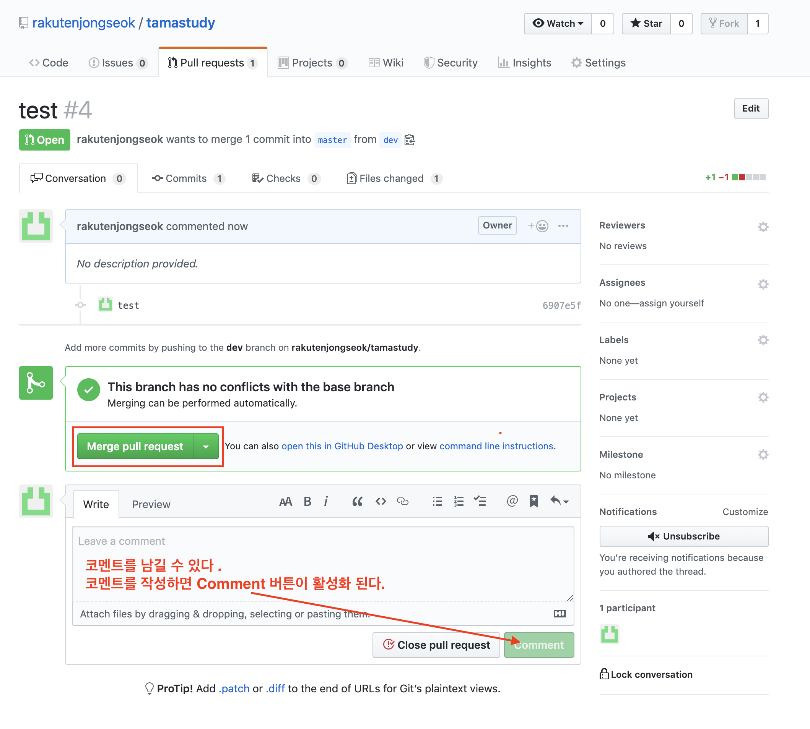
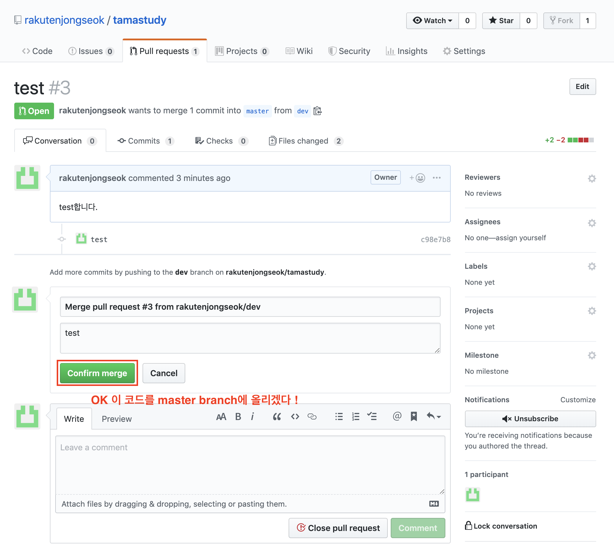

# 자신의 git에서 branch로 작업할 때

> 혼자 북치고 장구치고하는거라고 생각하면 됨!
> <br>
> 북 : branch -> master pull request
> <br>
> 장구 : pull request 온것을 merge

## 1. branch 생성하기

```bash
$ git branch branchName
```

## 2. branch 확인하기

```bash
$ git branch
```

## 3. branch 변경하기

```bash
$ git checkout branchName
```

## **4. branch 생성 및 변경 한번에 하기 (1번 3번 동시에)**

```bash
$ git checkout -b branchName
```

## 5. branch에서 master 소스로 최신화 해야할 때

```bash
$ git pull origin master
```

## 6. master가 아닌 branch에서 소스코드 업데이트하기

```bash
$ git add .
$ git commit -m ‘message’
$ git push origin branchName
```

## 7. Github 홈페이지에서 pull request하기






## 8. master에서 merge하기 (병합하기)




> master branch로 코드가 병합됩니다.
> <br>
> dev의 작업내역이 master에 적용됩니다.
