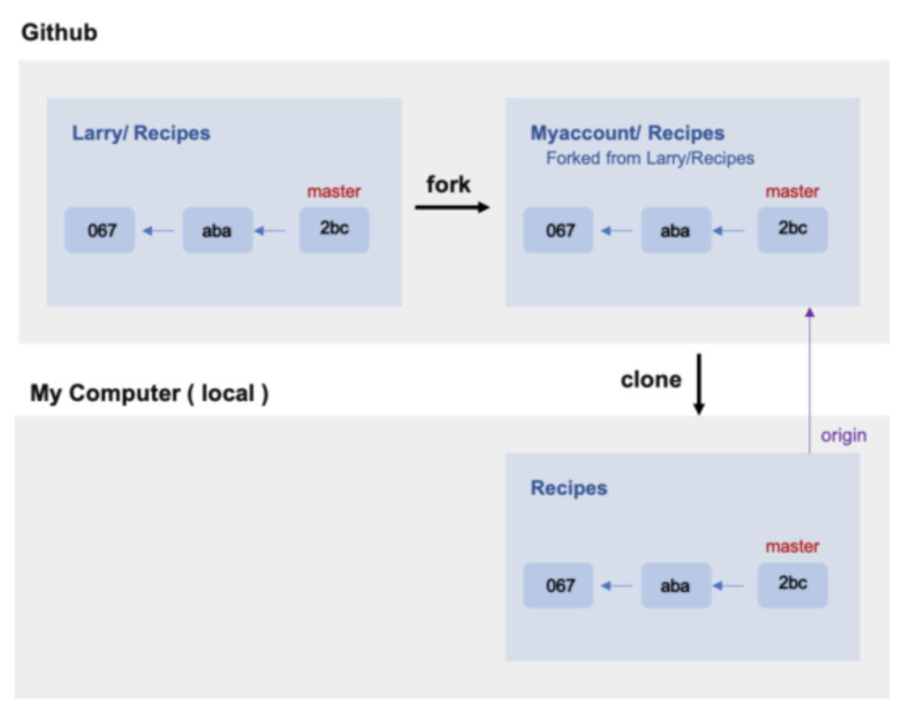
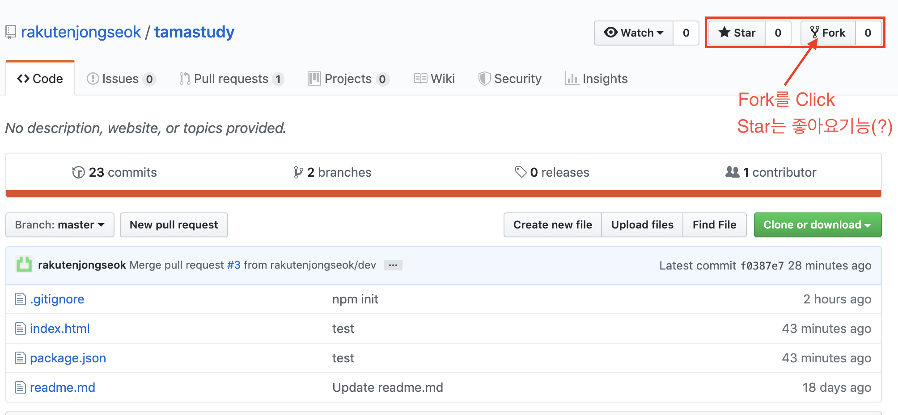
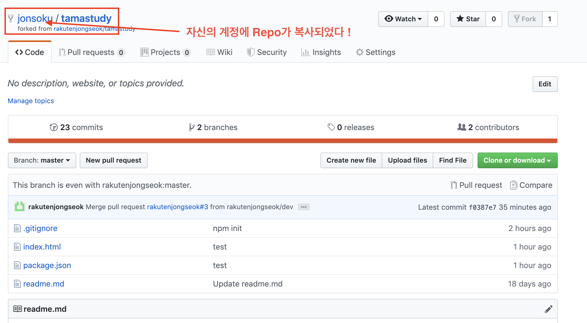
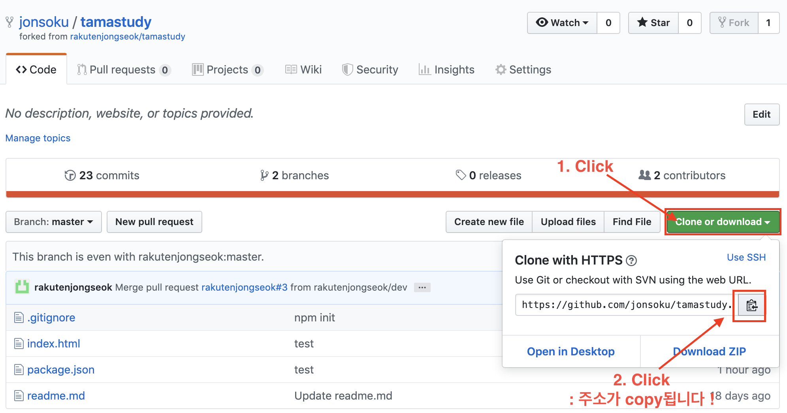
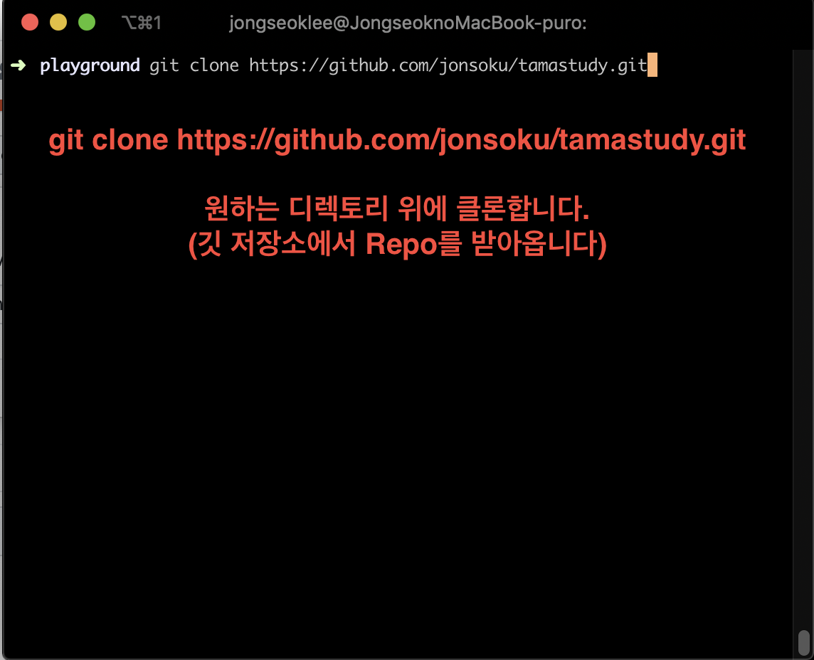
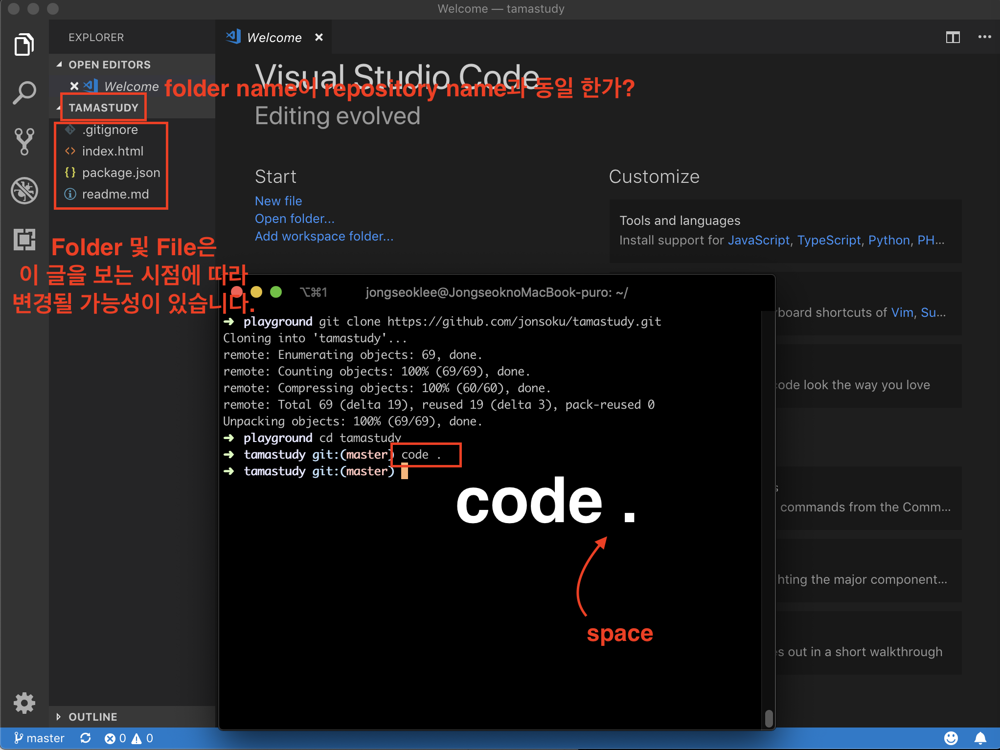

# Fork란 무엇인가 ?

fork는 다른 사람의 Github repository에서 내가 어떤 부분을 수정하거나 추가 기능을 넣고 싶을 때 해당 respository를 내 Github repository로 그대로 복제하는 기능이다. fork한 저장소는 원본(다른 사람의 github repository)와 연결되어 있다. 여기서 연결 되어 있다는 의미는 original repository에 어떤 변화가 생기면(새로운 commit) 이는 그대로 forked된 repository로 반영할 수 있다. 이 때 fetch나 rebase의 과정이 필요하다.

> 즉 Repository에 권한이 없는 사용자가 저장소를 fork하고 fork한 자신의 저장소에 변경 사항을 적용한 후 Push한다. 이 후 원래 저장소(original repository)에 내 저장소에 있는 브랜치를 Pull Request 한다. 내가 만든 코드가 ㅇㅋ되면 해당 저장소에 Merge 된다.



[자료 출처](https://velog.io/@imacoolgirlyo/Git-fork%EC%99%80-clone-%EC%9D%98-%EC%B0%A8%EC%9D%B4%EC%A0%90-5sjuhwfzgp)

# Fork 따라해보기

## 1. github 홈페이지에서 fork를 한다.

> 원본 Repository를 복사(?)하여 자신의 계정에 Repository를 생성하는 단계

## 1. github 홈페이지에서 원본 Repository를 fork를 한다.

> 원본 Repository (https://github.com/rakutenjongseok/tamastudy)를 복사(?)하여 자신의 계정에 Repository를 생성하는 것!




## 2. 자신의 계정의 Repo를 git clone 한다



## 3. 터미널을 키고 따라합시다 !

### 3-1. git clone



```bash
$ git clone https://github.com/jonsoku/tamastudy.git
```

> **jonsoku**/tamastudy.git
> <br/>
> ㄴ 자신의 계정 username으로 되어있는지 확인해주세요 !

### 3-2. clone한 repository를 vscode로 열기

```bash
$ cd tamastudy
$ code .
```



> code . 가 안될때는
> <br> http://blog.foundy.io/visual-studio-code-maeg-teomineoleseo-code-myeongryeongeo-path-seoljeonghagi/ <br>
> 참조해서 변경해두자 !

## 4. vscode terminal 열기

```
windows : ctrl + `
mac : cmd + `
```

> `키는 보통 숫자 1 왼쪽에 있다. "(큰따옴표)과 '(작은따옴표)와 헷갈리지않기!!
