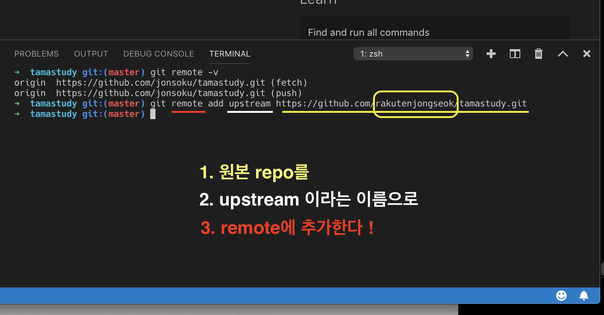
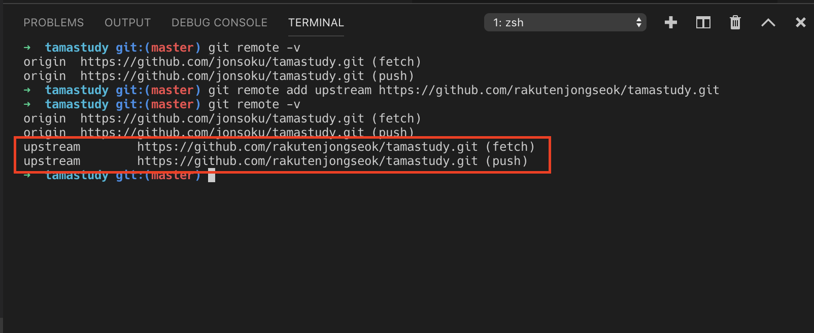
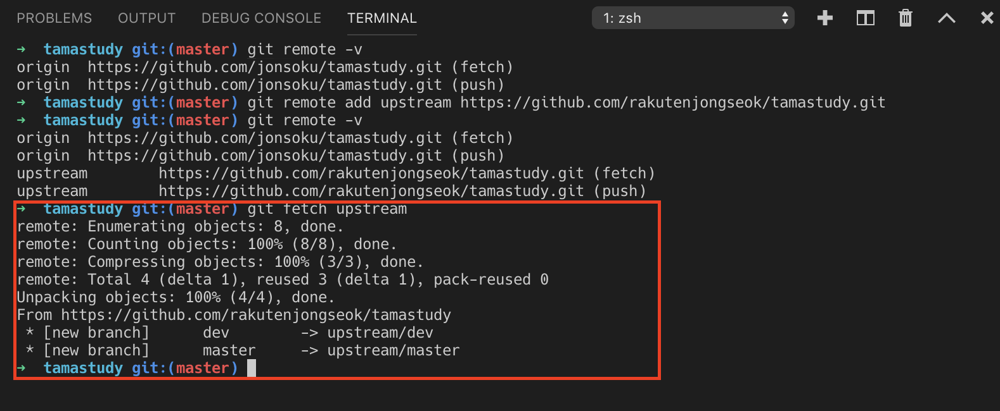
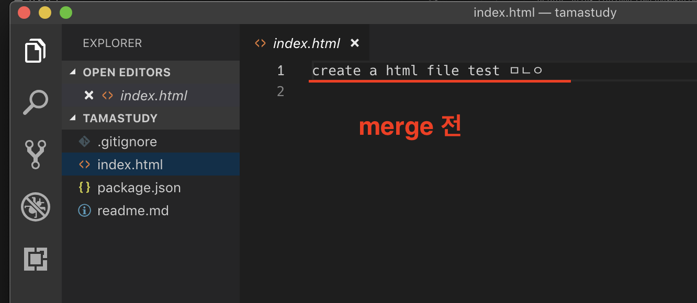
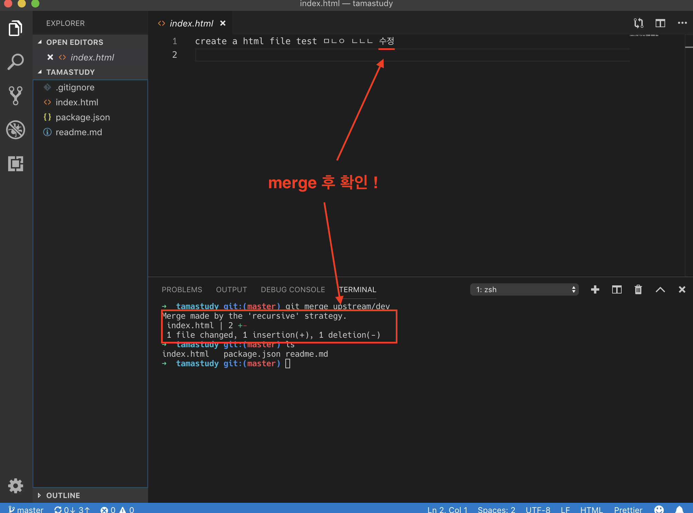

# fork해서 clone한 Repo를 수정해서 원본 Repo에 넣어보자!

개인프로젝트(?)에서 자신의 계정 하나로 branch를 만들고, branch에서 master로 pull request를 하는 개념과 똑같다!
fork는 원본 repository에서 branch들로 나누는 것이 아닌, fork한 사람들이 각각의 branch라고 생각하면 이해하기 편하다.

### **중요!**

> fork 는 open source project의 개념이다.
> <br>
> 각각의 fork한 사람이 원본 repo의 branch라고 생각하기!

## 1. 코드 수정하기전 merge하기

혹시나 1초차이로 원본 repository에 변화가 있을 수 있다.
코드를 최신화하지 않고, 수정했다가 pull request를 날렸다가,
충돌나서 거절당하면 노력이 헛수고가되니.. 최대한 선 merge로 코드를 최신화하고 작업한다.

### **중요!**

> 선 merge 후 수정!!

## 2. Fork 한 repository 최신으로 동기화하기

### 2-1. remote 확인하기

```bash
$ git remote -v
origin  https://github.com/jonsoku/YOUR_FORK.git (fetch)
origin  https://github.com/jonsoku/YOUR_FORK.git (push)
```


> 여기서 jonsoku는 **자신의** git username이다. (반드시)

### 2-2. 원본 repository를 remote에 추가한다.

```bash
$ git remote add upstream https://github.com/rakutenjongseok/tamastudy.git
```



> 여기서 rakutenjongseok **원본 repo**의 git username이다. (반드시)

### 2-3. upstream으로 잘 되있나 확인

```bash
$ git remote -v
```



### 2-4. upstream repo로부터 로컬 repo 최신화

git fetch 명령어로 upstream repository의 내용을 불러온다.

```bash
$ git fetch upstream
```



### 2-5. upstream repository 의 master branch (혹은 원하는 branch) 로부터 나의 local master branch 로 merge 한다.

> upstream = 원본

### 2-6. 일단 자신의 master branch로 변경

```bash
$ git checkout master
```

> 이미 master라면 변경안해도됨..

### 2-7. merge하기

```bash
$ git merge upstream/dev
```

> git merge upstream/master 하면 원본의 master repository를 기준으로 최신화
> <br>
> 하지만 보통 원본 repo에서는 dev branch에서 소스관리를 하기 때문에 이번에도 원본 dev branch기준으로 업데이트할꺼임!

## 3. merge 하기 전



## 4. merge 하고 난 후



## 5. 전/후가 다르다면 원본과 다르다는의미! 즉 최신화를했다 !
