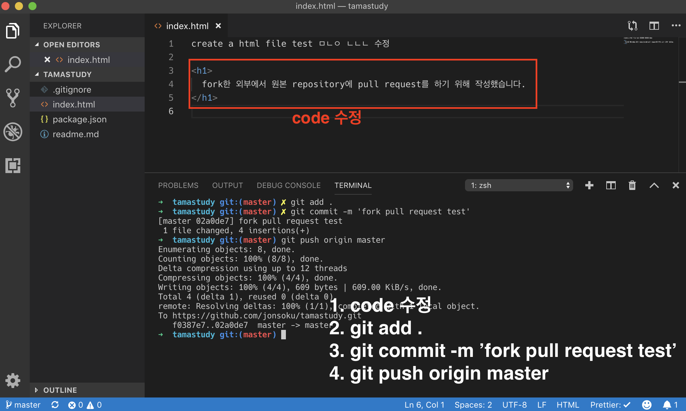
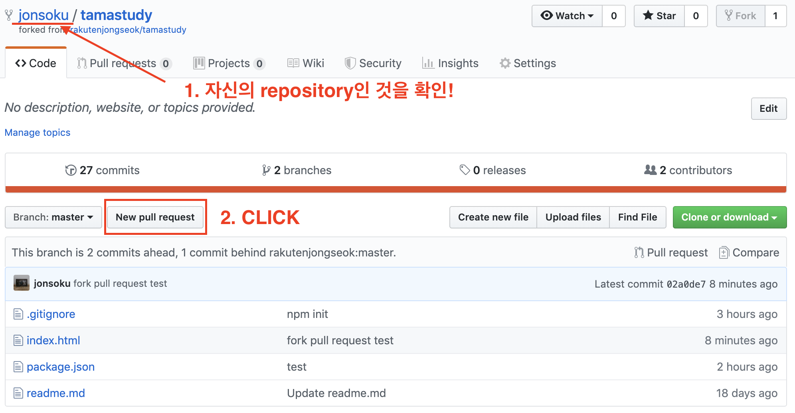
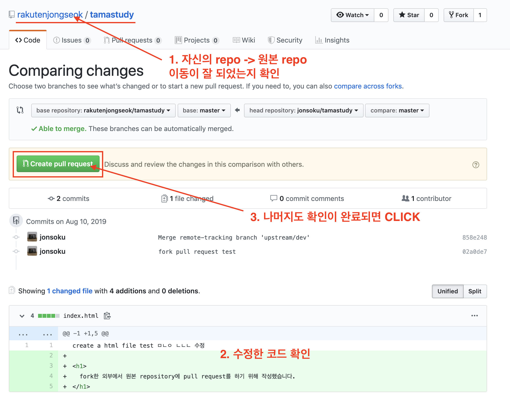
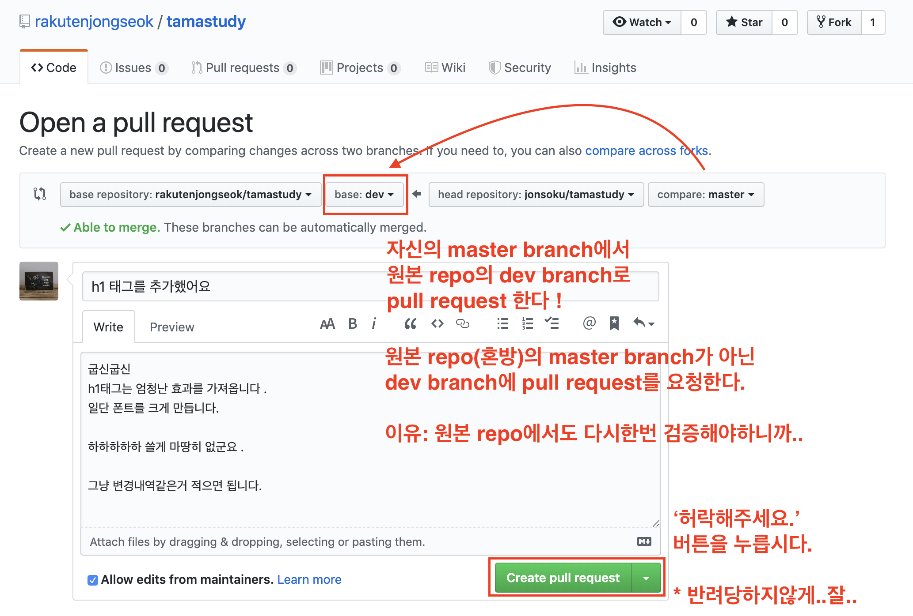
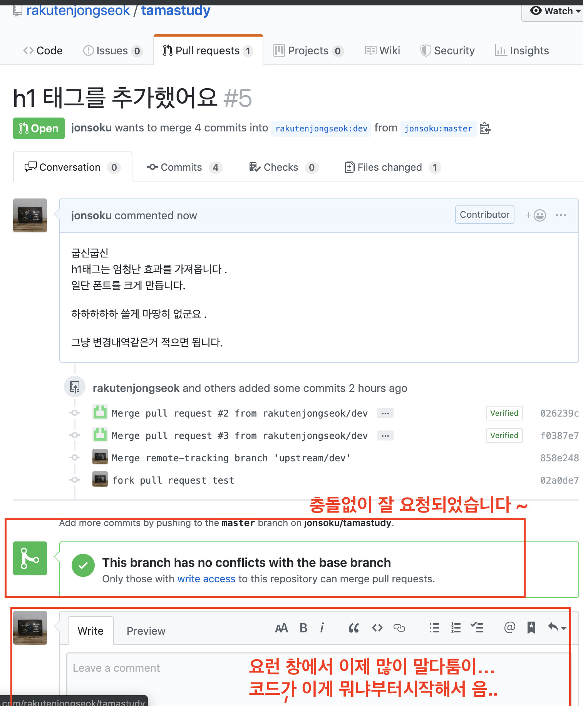

## 1. 로컬에서 코드를 수정하고 자신의 repo에 push까지 한다.

```bash
# code 수정 후
$ git add .
$ git commit -m 'message'
$ git push origin master
```



### **중요!**

> 원본 repo가 아니라, **자신**의 repo에 push한것입니다 !

## 2. github homepage에서 자신의 repo페이지로 접속



### **중요!**

> 원본 repo가 아니라, **자신**의 repo입니다 !!

## 3. Create pull request

자신의 repo의 변경내역을 원본 repo에 적용시키고싶다 !!!
일단 허락을 받는 단계!





<hr>

## 4. fork한 외부사용자가 pull request 까지의 과정 끝 !

> 이후로는 원본 repo 사용자가 요청받은 pull request의 소스코드를 보고 반려시키냐 아니면 master(혼방) 혹은 dev에 적용시키냐 안시키냐 판단을해서 괜찮으면 merge를 할꺼고, 개떡같으면 반려 (delete)를 시킬겁니다..
