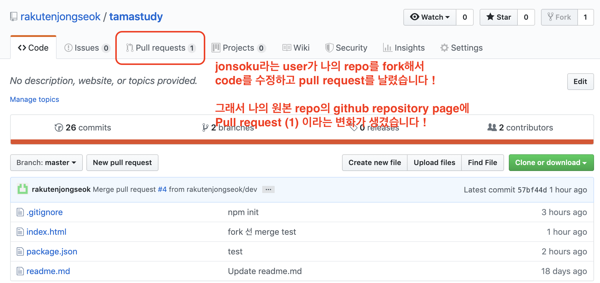
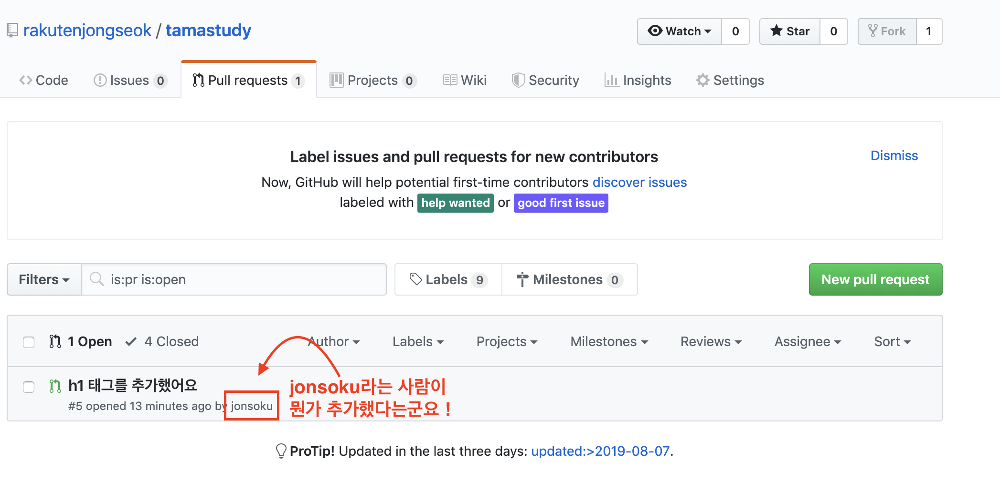
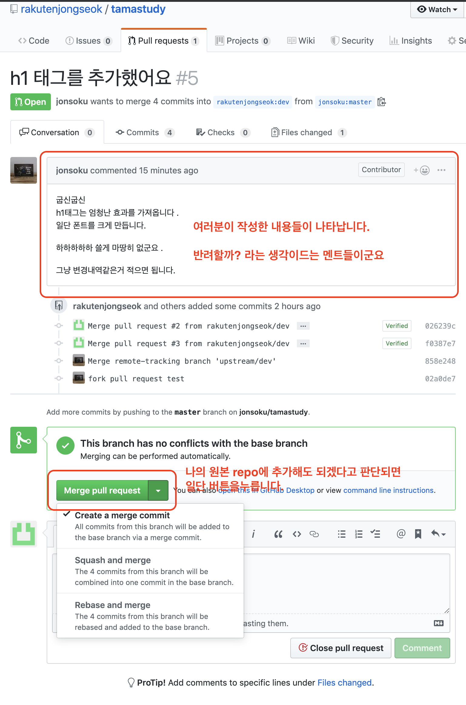
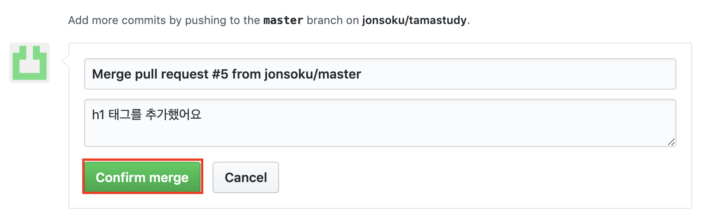
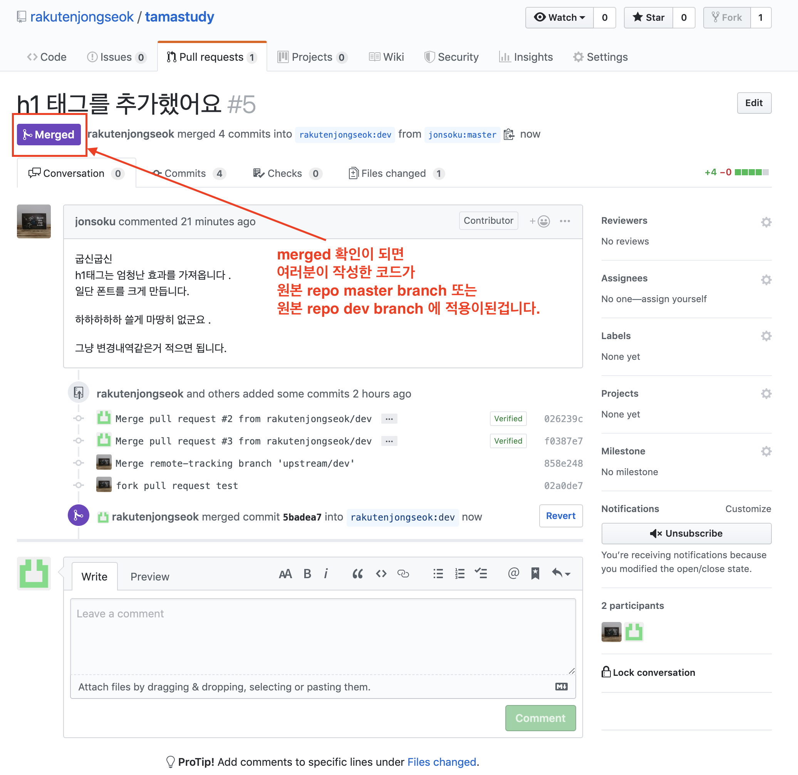
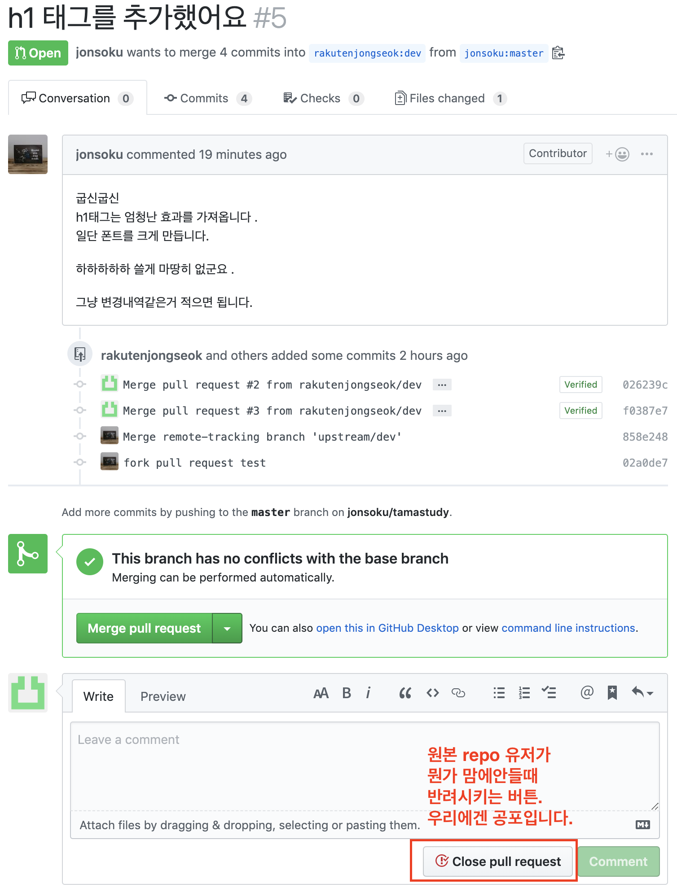
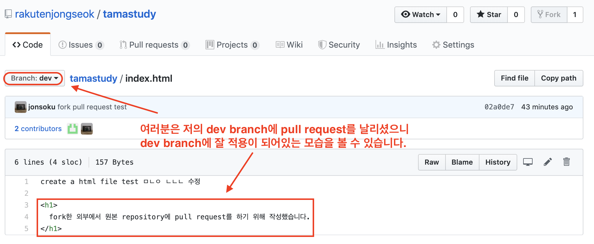

# 원본 repo 계정의 화면입니다 !

**여러분은 볼 수 없으니 혼동하지마세요 !** 
이 화면은 지금까지 여러분이 했던 pull request를 완료하면 **원본 repo**의 계정으로 로그인 했을 경우에만 나타나는 화면입니다.

> 원본 repo에 적용까지의 흐름을 알기위한 참고용으로 제작하였습니다 !!

> merge의 종류에 대한 [참고자료](https://meetup.toast.com/posts/122)

## if (맘에들지않음)

# 잘 들어왔나 확인해보기

